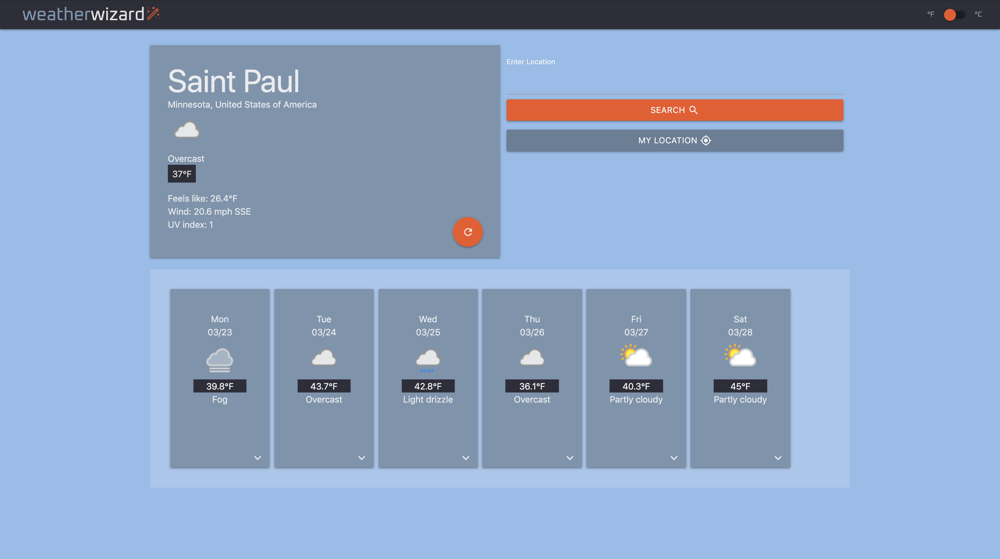
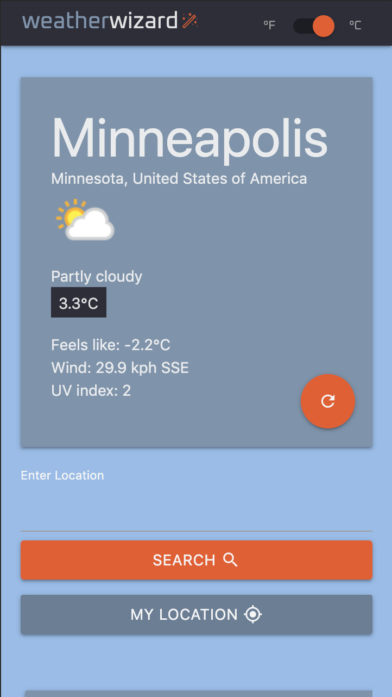

# Weather Wizard

Weather application created with using data from [WeatherAPI.com](https://www.weatherapi.com/).

Key technologies used:
    - React
    - Redux
    - Materialize.css
    - Moment.js
    - Gulp.js

## Usage
```
git clone https://github.com/jgullickson/weatherApp.git
cd weatherApp
npm install
npm start
```

## Screenshots



